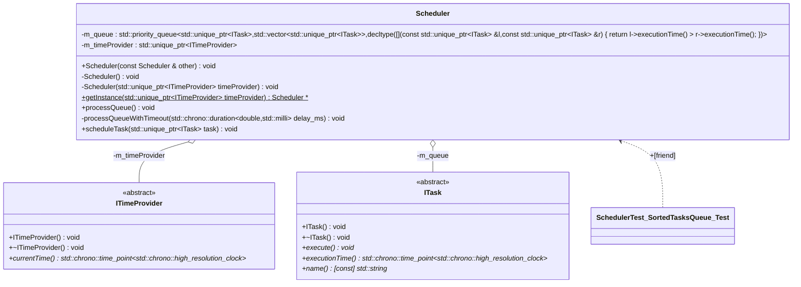
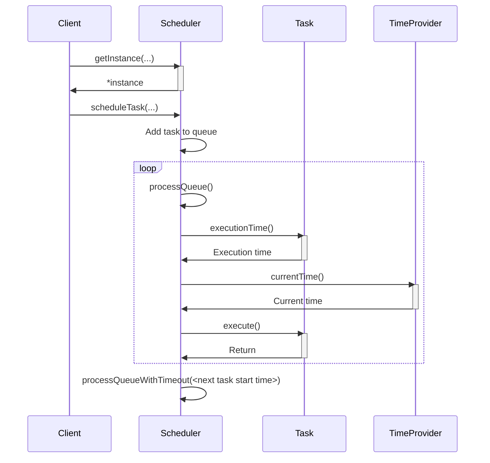

# sCheduler++

*DISCLAIMER: this library is not ready yet for the production usage.*

Use this library if you want to build your program on tasks and you need not only put tasks in queue, but also schedule them. E.g. you are making an Unified Endpoint Management (UEM) agent and you want to perform some action in specific time: install software, update OS, make another maintanence actions.

## Basic information
1. C++ 20 support required.
2. Calculations run in UTC time.
3. Scheduler precision - seconds.
4. Use chrono time primitives - don't use int for time.
5. There can be only one scheduler in your program, so it's a singletone.
6. This library do not provide multithreading - you can use it only from one thread and tasks are executed in the same thread where Scheduler was made. But getting instance of the scheduler is threadsafe due to the implementation of the singletone.

## Behaviour
1. If execution time of the task is passed, then this task will be executed immidiately.
2. Tasks are not replaced - if you are adding a task and task with the same type is already scheduled, than it will be just added. If tasks have the same time of execution then there is not defined in which order they will execute.

## Possible future improvements
1. Persist tasks (e.g. in SQLite). Add tests: restoration of the tasks from DB and execution of them after restore if it's time is passed.
2. Provide multithreading use of Scheduler - make it possible to be used from different threads.
3. Provide multithread execution of the tasks.
4. Add execution policy - replace tasks if it exist or add it.
5. Determine order of execution tasks in case when youre tasks with the same type and time of execution. I assume the better option is to execute in order of adding tasks - FIFO model.
6. Add support of using of local time, not only UTC.
7. Separate the timer into a separate entity.
    1. Add possibility to tweak scheduler behaviour by using youre own timer.

# Architecture

## Class diagram

## Sequence diagram


# Example

```cpp
class ExampleTask : public scheduler::ITask {
public:
    ExampleTask(std::chrono::time_point<std::chrono::high_resolution_clock> time, const std::string& name)
        : m_executionTime(time)
        , m_name(name)
    {}
    virtual ~ExampleTask(){}

    void execute() override {
        std::cout << "Exec!" << std::endl;
    }

    std::chrono::time_point<std::chrono::high_resolution_clock> executionTime() override {
        return m_executionTime;
    }

    std::string name() const override {
        return m_name;
    }

private:
    std::chrono::time_point<std::chrono::high_resolution_clock> m_executionTime;
    std::string m_name;
};

int main(int argc, char **argv) {
    scheduler::Scheduler* scheduler = scheduler::Scheduler::getInstance(std::make_unique<scheduler::DefaultTimeProvider>());
    scheduler->scheduleTask(std::make_unique<ExampleTask>(std::chrono::high_resolution_clock::now(),
                                                          "ExampleTask"));
    return 0;
}
```


# Reference
1. Base doc for the project is [cppreference](https://en.cppreference.com/index.html), especially [Date and time library](https://en.cppreference.com/w/cpp/chrono.html).
2. Thanks to the project [timercpp](https://github.com/99x/timercpp) and article where I've found it [A Simple Timer in C++](https://www.fluentcpp.com/2018/12/28/timer-cpp/).
3. [GoogleTest User’s Guide](https://google.github.io/googletest/).
4. [Mermaid](https://mermaid.js.org/).
5. [doxygen](https://www.doxygen.nl/index.html).
6. [Visualizing modern C++ code using Clang and UML](https://blog.bkryza.com/posts/generating-uml-diagrams-from-moderncpp-using-clang/).
